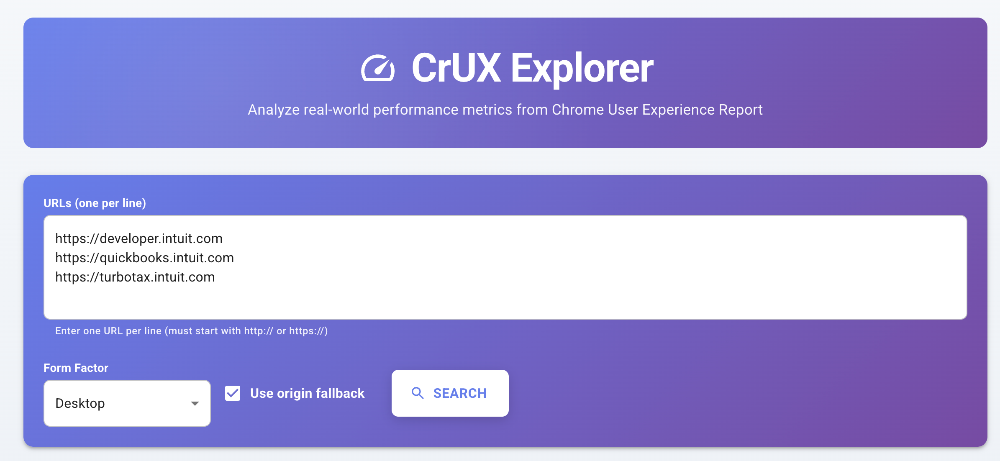
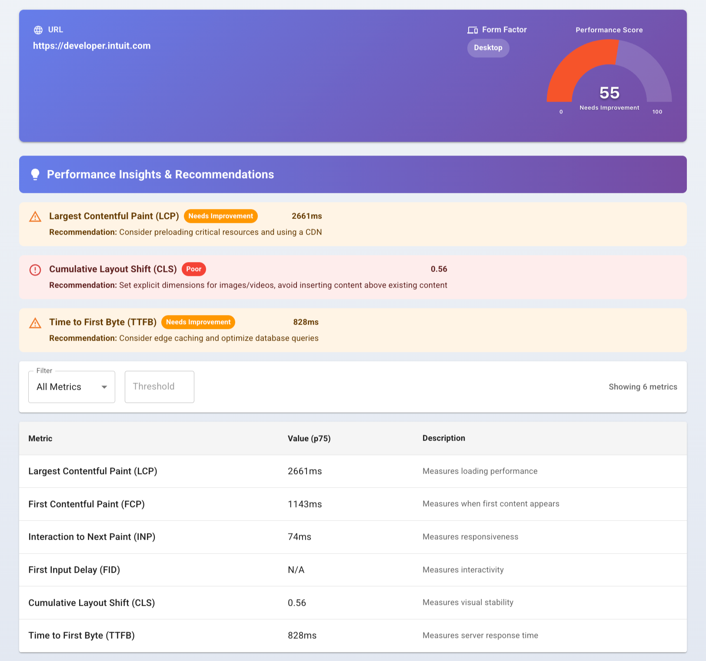
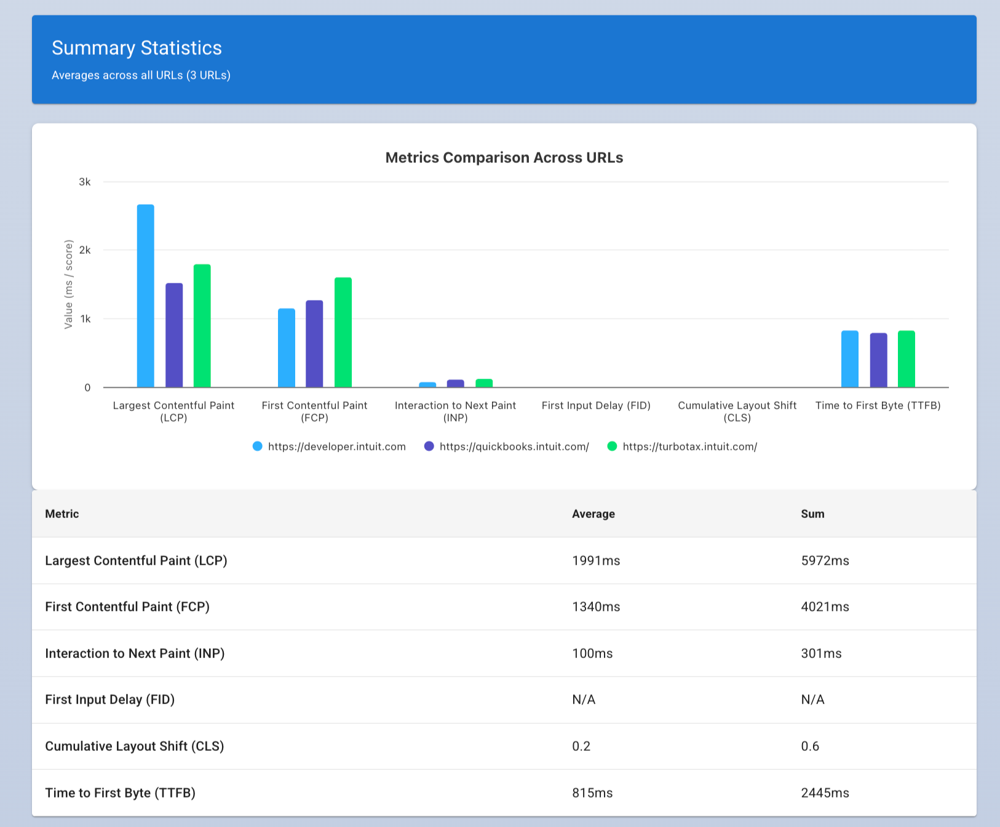

# CrUX Explorer

A full-stack web application for exploring Chrome User Experience Report (CrUX) data with advanced filtering, sorting, visualization, and analytics capabilities.

## 🚀 Live Demo

**[🔗 View Live Demo](https://brightedge-crux.vercel.app/)**

Experience the application in action at: **https://brightedge-crux.vercel.app/**

Check out the [🚀 Setup Instructions](#-setup-instructions) to get started on your local machine.

## 📸 Screenshots

### Main Search Interface

_Multi-URL search with form factor selection and origin fallback option_

### Performance Gauge, Insights, and Metrics

_Speedometer-style performance gauge showing overall score (0-100)_
_Automated recommendations for improving poor-performing metrics_

### Metrics Comparison Chart, and Summary Statistics

_Column chart comparing Core Web Vitals across multiple URLs_
_Aggregated metrics and comparison charts for all queried URLs_

## 📋 Table of Contents

- [🚀 Live Demo](#-live-demo)
- [📸 Screenshots](#-screenshots)
- [🎯 Overview](#-overview)
- [✨ Features](#-features)
- [🔍 How It Works](#-how-it-works)
- [🏗️ Architecture](#️-architecture)
- [🛠️ Tech Stack](#️-tech-stack)
- [📁 Project Structure](#-project-structure)
- [🎨 Design Architecture](#-design-architecture)
- [🧩 Component Architecture](#-component-architecture)
- [🚀 Setup Instructions](#-setup-instructions)
- [📖 Usage](#-usage)
- [🔌 API Documentation](#-api-documentation)
- [💻 Development](#-development)
- [⚠️ Known Issues](#️-known-issues)
- [🚀 Next Steps](#-next-steps-1)

## 🎯 Overview

CrUX Explorer is a production-ready, full-stack application that allows users to query and analyze Chrome User Experience Report (CrUX) data from Google's public API. It provides an intuitive, visually appealing interface to search for multiple URLs simultaneously, view Core Web Vitals metrics, analyze performance insights, and visualize data through interactive charts.

The application is built with modern web technologies, follows industry best practices, and implements a robust architecture with proper error handling, URL validation, and comprehensive data visualization.

## ✨ Features

### Core Functionality
- **Multi-URL Search**: Query CrUX data for multiple URLs simultaneously (one per line)
- **URL Validation**: Real-time validation of URLs with detailed error messages
- **Form Factor Selection**: Filter by device type (Phone, Desktop, Tablet, or Any)
- **Origin Fallback**: Automatically fall back to origin-level data when URL-specific data is unavailable
- **Core Web Vitals Display**: View all 6 metrics (LCP, FCP, INP, FID, CLS, TTFB) with p75 values

### Data Analysis & Visualization
- **Performance Gauge Charts**: Speedometer-style gauges showing performance scores (0-100)
- **Metrics Comparison Charts**: Column charts comparing metrics across multiple URLs
- **Summary Statistics**: Aggregated averages across all queried URLs
- **Performance Insights**: Automated recommendations for improving poor-performing metrics
- **Color-Coded Ratings**: Visual indicators for Good (Green), Needs Improvement (Orange), and Poor (Red)

### Advanced Features
- **Filtering**: Filter metrics by threshold values (Greater Than, Less Than, Equal To)
- **Sorting**: Sort metrics by name or value (ascending/descending)
- **Error Handling**: Comprehensive error messages for invalid URLs, failed requests, and missing data
- **Partial Results**: Display successful results even when some URLs fail
- **Loading States**: Visual feedback during API requests
- **Responsive Design**: Material UI components for a professional, mobile-friendly interface
- **Real-time Updates**: Hot module replacement for instant feedback during development

### UI/UX Enhancements
- **Beautiful Gradients**: Purple gradient theme throughout the application
- **Interactive Charts**: Powered by Highcharts with tooltips and animations
- **Professional Typography**: Carefully crafted font sizes, weights, and spacing
- **Accessible Components**: WCAG-compliant Material UI components
- **Empty States**: Helpful messages when no data is available

## 🔍 How It Works

### User Flow

1. **User Input**
   - User enters one or more URLs (one per line) in the URL input field
   - URLs are validated in real-time using regex and URL constructor
   - Invalid URLs are highlighted with error messages showing line numbers

2. **Form Configuration**
   - User selects a form factor (Phone, Desktop, Tablet, or Any)
   - User optionally enables origin fallback for better data availability
   - User clicks the "Search" button to submit the query

3. **Request Processing**
   - Frontend validates all URLs before sending the request
   - If validation fails, error messages are displayed inline
   - Valid URLs are sent to the backend via POST request to `/api/crux`

4. **Backend Proxy**
   - Backend receives the request and validates the payload
   - For each URL, backend makes a request to Google's CrUX API
   - Backend aggregates all responses and returns them to the frontend
   - API key is kept secure on the backend (never exposed to frontend)

5. **Data Transformation**
   - Frontend receives raw CrUX data from backend
   - Data is transformed into a normalized format with metric definitions
   - Each metric includes: name, value (p75), unit, description, thresholds
   - Performance scores are calculated based on thresholds

6. **Data Display**
   - Results are displayed in individual data tables for each URL
   - Each table shows all 6 Core Web Vitals metrics
   - Performance gauge shows overall score (0-100)
   - Metrics comparison chart shows side-by-side comparison
   - Summary section shows aggregated statistics

7. **User Interaction**
   - User can filter metrics by threshold values
   - User can sort metrics by name or value
   - User can view performance insights and recommendations
   - User can query new URLs without page refresh

### Data Flow Diagram

```
┌─────────────┐
│   User      │
└──────┬──────┘
       │ Enters URLs
       ▼
┌─────────────────────┐
│  URL Validation     │ ◄── validation.utils.js
└──────┬──────────────┘
       │ Valid URLs
       ▼
┌─────────────────────┐
│  SearchForm         │
└──────┬──────────────┘
       │ POST /api/crux
       ▼
┌─────────────────────┐
│  Backend Proxy      │ ◄── Express Server
└──────┬──────────────┘
       │ Multiple API calls
       ▼
┌─────────────────────┐
│  Google CrUX API    │
└──────┬──────────────┘
       │ Raw CrUX data
       ▼
┌─────────────────────┐
│  Data Transform     │ ◄── crux.utils.js
└──────┬──────────────┘
       │ Normalized data
       ▼
┌─────────────────────┐
│  Results Display    │
│  - Data Tables      │
│  - Gauge Charts     │
│  - Comparison Chart │
│  - Insights Panel   │
│  - Summary Stats    │
└─────────────────────┘
```

## 🏗️ Architecture

### System Architecture

The application follows a **client-server architecture** with clear separation of concerns:

```
┌──────────────────────────────────────────────────────────┐
│                     Frontend (React)                      │
│  ┌────────────────────────────────────────────────────┐  │
│  │  Pages (CruxExplorerPage)                          │  │
│  │  ├── Organisms (SearchForm, DataTable, Charts)    │  │
│  │  │   ├── Molecules (PageHeader, Gauge, etc.)      │  │
│  │  │   │   └── Atoms (Buttons, Inputs, etc.)        │  │
│  └────────────────────────────────────────────────────┘  │
│  ┌────────────────────────────────────────────────────┐  │
│  │  Services (api.service.js)                         │  │
│  └────────────────────────────────────────────────────┘  │
│  ┌────────────────────────────────────────────────────┐  │
│  │  Utils (crux.utils, chart.utils, validation)      │  │
│  └────────────────────────────────────────────────────┘  │
│  ┌────────────────────────────────────────────────────┐  │
│  │  Constants (theme, chart, crux, metrics)          │  │
│  └────────────────────────────────────────────────────┘  │
└──────────────────────────────────────────────────────────┘
                           │
                           │ HTTP/JSON
                           ▼
┌──────────────────────────────────────────────────────────┐
│                  Backend (Node.js/Express)                │
│  ┌────────────────────────────────────────────────────┐  │
│  │  Express Server (index.js)                         │  │
│  │  ├── CORS Middleware                               │  │
│  │  │   └── Body Parser                               │  │
│  │  └── POST /api/crux endpoint                       │  │
│  └────────────────────────────────────────────────────┘  │
└──────────────────────────────────────────────────────────┘
                           │
                           │ HTTPS/JSON
                           ▼
┌──────────────────────────────────────────────────────────┐
│              Google CrUX API (External)                   │
│  chromeuxreport.googleapis.com/v1/records:queryRecord    │
└──────────────────────────────────────────────────────────┘
```

### Frontend Architecture
- **Framework**: React 19 with functional components and hooks
- **UI Library**: Material UI (MUI) v7 with Emotion for styling
- **Charts**: Highcharts 12.4.0 with React wrapper
- **Build Tool**: Vite 7.1.12 for fast development and optimized production builds
- **State Management**: React useState hooks (no external state library needed)
- **Component Pattern**: Atomic Design (Atoms → Molecules → Organisms → Pages)
- **Package Manager**: pnpm for efficient dependency management

### Backend Architecture
- **Runtime**: Node.js 18+
- **Framework**: Express 5.1.0
- **API Client**: Axios 1.13.1 for CrUX API requests
- **Middleware**: CORS 2.8.5, body-parser (built-in)
- **Environment**: dotenv 17.2.3 for configuration
- **Security**: API key stored in environment variables, never exposed to frontend

## 🛠️ Tech Stack

### Frontend Dependencies
```json
{
  "react": "^19.2.0",
  "react-dom": "^19.2.0",
  "@mui/material": "^7.3.4",
  "@mui/icons-material": "^7.3.4",
  "@emotion/react": "^11.14.0",
  "@emotion/styled": "^11.14.1",
  "highcharts": "^12.4.0",
  "highcharts-react-official": "^3.2.3"
}
```

### Backend Dependencies
```json
{
  "express": "^5.1.0",
  "axios": "^1.13.1",
  "cors": "^2.8.5",
  "dotenv": "^17.2.3"
}
```

### Development Dependencies
```json
{
  "@vitejs/plugin-react": "^4.3.4",
  "vite": "^7.1.12",
  "eslint": "^9.18.0",
  "nodemon": "^3.1.9"
}
```

## 📁 Project Structure

```
brightedge-crux/
├── backend/
│   ├── src/
│   │   └── index.js                    # Express server & CrUX API proxy
│   ├── package.json
│   ├── pnpm-lock.yaml
│   └── .env                            # Environment variables (not in git)
│
├── frontend/
│   ├── public/                         # Static assets
│   ├── src/
│   │   ├── components/                 # Atomic Design components
│   │   │   ├── atoms/                  # Basic building blocks (11 components)
│   │   │   │   ├── EmptyState/
│   │   │   │   ├── FormFactorSelect/
│   │   │   │   ├── MetricDescription/
│   │   │   │   ├── MetricName/
│   │   │   │   ├── MetricValue/
│   │   │   │   ├── OriginFallbackCheckbox/
│   │   │   │   ├── SearchButton/
│   │   │   │   ├── UrlInput/
│   │   │   │   └── index.js            # Barrel export
│   │   │   ├── molecules/              # Simple component groups (5 components)
│   │   │   │   ├── FilterTypeSelect/
│   │   │   │   ├── PageHeader/
│   │   │   │   ├── PerformanceGauge/   # Speedometer chart
│   │   │   │   ├── SortableTableHeader/
│   │   │   │   ├── ThresholdInput/
│   │   │   │   └── index.js
│   │   │   ├── organisms/              # Complex components (8 components)
│   │   │   │   ├── CruxDataTable/      # Main data table
│   │   │   │   ├── ErrorMessage/
│   │   │   │   ├── FilterToolbar/
│   │   │   │   ├── InsightsPanel/      # Performance insights
│   │   │   │   ├── MetricsComparisonChart/  # Column chart
│   │   │   │   ├── MetricsTable/
│   │   │   │   ├── ResultHeader/
│   │   │   │   ├── SearchForm/
│   │   │   │   ├── SummarySection/     # Aggregated stats
│   │   │   │   └── index.js
│   │   │   └── pages/                  # Full page layouts (1 component)
│   │   │       ├── CruxExplorerPage/
│   │   │       └── index.js
│   │   ├── constants/                  # Configuration & constants
│   │   │   ├── chart.constants.js      # Chart colors, configs, dimensions
│   │   │   ├── crux.constants.js       # CrUX API constants
│   │   │   ├── metrics.constants.js    # Metric definitions, thresholds
│   │   │   └── theme.constants.js      # Colors, spacing, gradients
│   │   ├── readers/                    # Safe property accessors
│   │   │   └── index.js                # Null-safe readers
│   │   ├── services/                   # API service layer
│   │   │   └── api.service.js          # Backend API client
│   │   ├── utils/                      # Utility functions
│   │   │   ├── chart.utils.js          # Chart building functions
│   │   │   ├── crux.utils.js           # CrUX data transformation
│   │   │   ├── metrics.utils.js        # Metric calculations
│   │   │   └── validation.utils.js     # URL validation
│   │   ├── App.jsx                     # Root component
│   │   ├── main.jsx                    # Entry point
│   │   └── index.css                   # Global styles
│   ├── package.json
│   ├── pnpm-lock.yaml
│   ├── vite.config.js                  # Vite configuration
│   ├── eslint.config.js                # ESLint configuration
│   └── index.html                      # HTML template
│
└── README.md                           # This file
```

## 🚀 Setup Instructions

### Prerequisites
- Node.js (v18 or higher)
- pnpm (recommended) or npm

### Installation

1. **Clone the repository**
```bash
git clone <repository-url>
cd brightedge-crux
```

2. **Install backend dependencies**
```bash
cd backend
pnpm install
```

3. **Configure environment variables**
Create a `.env` file in the `backend` directory:
```env
CRUX_API_KEY=your_crux_api_key_here
PORT=3001
```

4. **Install frontend dependencies**
```bash
cd ../frontend
pnpm install
```

### Running the Application

1. **Start the backend server** (from `backend/` directory):
```bash
pnpm run dev
```
Server will run on `http://localhost:3001`

2. **Start the frontend dev server** (from `frontend/` directory):
```bash
pnpm run dev
```
Application will be available at `http://localhost:5173`

### Building for Production

**Frontend**:
```bash
cd frontend
pnpm run build
```
Production files will be in `frontend/dist/`

## 📖 Usage

1. **Enter a URL** in the search field (e.g., `https://developer.chrome.com`)
2. **Select a form factor** (Any, Phone, Desktop, or Tablet)
3. **Toggle origin fallback** if you want to fall back to origin-level data
4. **Click Search** to fetch CrUX data
5. **View results** in the data table showing all Core Web Vitals
6. **Filter metrics** using the filter toolbar (All, Greater Than, Less Than, Equal To)
7. **Sort metrics** by clicking on column headers (Metric name or Value)

## 🎨 Design Architecture

### Atomic Design Pattern

The application strictly follows **Atomic Design** methodology for component organization:

```
Atoms (11) → Molecules (5) → Organisms (8) → Pages (1)
```

**Benefits:**
- **Reusability**: Atoms can be used in multiple molecules/organisms
- **Maintainability**: Changes to atoms automatically propagate
- **Testability**: Small, focused components are easier to test
- **Scalability**: Easy to add new features by composing existing components
- **Consistency**: Shared atoms ensure consistent UI across the app

### Constants-Driven Architecture

All configuration is centralized in `constants/` directory:

- **`chart.constants.js`**: Chart colors, dimensions, Highcharts configs
- **`crux.constants.js`**: API endpoints, form factor options, default values
- **`metrics.constants.js`**: Metric definitions, thresholds, performance ratings
- **`theme.constants.js`**: Colors, spacing, gradients, common styles

**Benefits:**
- **Single Source of Truth**: Change a value once, updates everywhere
- **Type Safety**: Constants prevent typos and magic strings
- **Maintainability**: Easy to find and update configuration
- **Documentation**: Constants serve as self-documenting code

### Utility Functions

Reusable logic is extracted to `utils/` directory:

- **`chart.utils.js`**: Chart building functions (gauge, comparison)
- **`crux.utils.js`**: CrUX data parsing and transformation
- **`metrics.utils.js`**: Metric calculations and filtering
- **`validation.utils.js`**: URL validation and error handling

**Benefits:**
- **DRY Principle**: Don't Repeat Yourself
- **Testability**: Pure functions are easy to unit test
- **Reusability**: Same logic used across multiple components
- **Separation of Concerns**: Business logic separated from UI

### Readers Pattern

Safe property access using reader functions in `readers/`:

```javascript
// Instead of: result.metrics.lcp.p75
// Use: readMetricValue(result, 'lcp')
```

**Benefits:**
- **Null Safety**: No "Cannot read property of undefined" errors
- **Graceful Degradation**: Returns default values for missing data
- **Consistency**: Same access pattern throughout the app

## 🧩 Component Architecture

The application follows **Atomic Design** principles with 25 total components:

### Atoms (11 components)
Basic building blocks that cannot be broken down further:

| Component | Purpose | Props |
|-----------|---------|-------|
| `SearchButton` | Submit button with loading state | `loading`, `type` |
| `UrlInput` | Multi-line URL input with validation | `value`, `onChange`, `error`, `helperText` |
| `FormFactorSelect` | Device type dropdown | `value`, `onChange` |
| `OriginFallbackCheckbox` | Origin fallback toggle | `checked`, `onChange` |
| `MetricValue` | Formatted metric value display | `value`, `unit` |
| `MetricName` | Metric name with tooltip | `name` |
| `MetricDescription` | Metric description text | `description` |
| `EmptyState` | Empty state message | `message` |

### Molecules (5 components)
Simple component groups combining atoms:

| Component | Purpose | Atoms Used |
|-----------|---------|------------|
| `PageHeader` | Page title and subtitle with gradient | Typography, Paper, Box |
| `PerformanceGauge` | Speedometer chart (0-100 score) | Highcharts, Box, Typography |
| `SortableTableHeader` | Clickable table header with sort icon | TableCell, TableSortLabel |
| `FilterTypeSelect` | Filter type dropdown | FormControl, Select, MenuItem |
| `ThresholdInput` | Numeric threshold input | TextField |

### Organisms (8 components)
Complex components combining molecules and atoms:

| Component | Purpose | Key Features |
|-----------|---------|--------------|
| `SearchForm` | Complete search form | URL validation, form factor, fallback, submit |
| `ErrorMessage` | Error alert display | Dismissible, color-coded severity |
| `ResultHeader` | Result information header | URL, form factor, gradient background |
| `FilterToolbar` | Filter controls | Filter type, threshold, metric count |
| `MetricsTable` | Sortable metrics table | Sorting, custom columns, empty state |
| `CruxDataTable` | Full data table | Filtering, sorting, all metrics |
| `InsightsPanel` | Performance insights | Automated recommendations, color-coded |
| `SummarySection` | Aggregated statistics | Average metrics, performance gauge |
| `MetricsComparisonChart` | Column chart | Multi-URL comparison, tooltips |

### Pages (1 component)
Full page layouts orchestrating all organisms:

| Component | Purpose | Key Features |
|-----------|---------|--------------|
| `CruxExplorerPage` | Main application page | State management, API calls, error handling, layout |

## 🔌 API Documentation

### Backend Endpoint

**POST** `/api/crux`

Request body:
```json
{
  "urls": ["https://example.com"],
  "formFactor": "PHONE",
  "originFallback": true
}
```

Response:
```json
{
  "results": [{
    "status": "ok",
    "url": "https://example.com",
    "formFactor": "PHONE",
    "metrics": {
      "lcp": { "p75": 2500 },
      "fcp": { "p75": 1800 },
      "inp": { "p75": 200 },
      "fid": { "p75": 100 },
      "cls": { "p75": 0.1 },
      "ttfb": { "p75": 800 }
    }
  }]
}
```

## 💻 Development

### Code Organization

- **Constants**: All magic values are extracted to `constants/` directory
- **Readers**: Safe property accessors in `readers/` directory
- **Utils**: Pure utility functions in `utils/` directory
- **Services**: API communication in `services/` directory
- **Components**: Atomic Design structure in `components/` directory

### Key Design Decisions

1. **Atomic Design**: Ensures reusability and maintainability
2. **Readers Pattern**: Provides null-safe property access throughout the app
3. **Constants Extraction**: Single source of truth for all configuration
4. **Separation of Concerns**: Clear boundaries between UI, logic, and data
5. **Material UI**: Professional, accessible, and responsive components

### Development Tools

- **Vite**: Fast HMR and optimized builds
- **ESLint**: Code quality and consistency
- **React DevTools**: Component inspection and debugging
- **Nodemon**: Auto-restart backend on changes

### Development Workflow

1. **Start Backend** (Terminal 1):
   ```bash
   cd backend
   pnpm run dev
   ```

2. **Start Frontend** (Terminal 2):
   ```bash
   cd frontend
   pnpm run dev
   ```

3. **Make Changes**:
   - Edit files in `src/`
   - Changes auto-reload via HMR
   - Check console for errors

4. **Test Changes**:
   - Test in browser at `http://localhost:5173`
   - Check Network tab for API calls
   - Verify error handling

5. **Build for Production**:
   ```bash
   cd frontend
   pnpm run build
   ```

## ⚠️ Known Issues

### Current Limitations

1. **CrUX API Data Availability**
   - Not all URLs have CrUX data available
   - Data is only available for URLs with sufficient traffic
   - Some URLs may only have origin-level data
   - **Workaround**: Enable "Origin Fallback" option

2. **Rate Limiting**
   - Google CrUX API has rate limits
   - Multiple simultaneous requests may be throttled
   - **Workaround**: Query URLs in smaller batches

3. **Historical Data**
   - CrUX API only provides the most recent 28-day data
   - No historical trend analysis available
   - **Future Enhancement**: Store historical data in database

4. **Bundle Size**
   - Current bundle size is ~837 KB (283 KB gzipped)
   - Highcharts library contributes significantly to bundle size
   - **Future Enhancement**: Implement code splitting and lazy loading

5. **Mobile Responsiveness**
   - Charts may not be optimally sized on very small screens
   - **Future Enhancement**: Implement responsive chart dimensions

### Error Handling

The application handles the following error scenarios:

- ✅ Invalid URL format (with line-by-line validation)
- ✅ Empty URL input
- ✅ Network errors (backend unreachable)
- ✅ API errors (CrUX API failures)
- ✅ Missing data for specific URLs (partial results displayed)
- ✅ Malformed API responses
- ⚠️ Rate limiting (shows generic error, could be improved)

## 🚀 Next Steps

### Short-term Improvements

1. **Enhanced Error Messages**
   - Distinguish between different error types (network, API, validation)
   - Provide actionable suggestions for each error type
   - Add retry mechanism for failed requests

2. **Performance Optimizations**
   - Implement code splitting for charts (lazy load Highcharts)
   - Add service worker for offline support
   - Optimize bundle size with tree shaking

3. **User Experience**
   - Add loading skeleton screens instead of spinners
   - Implement URL autocomplete from browser history
   - Add "Clear All" button for URL input
   - Add "Export to CSV" functionality

4. **Testing**
   - Add unit tests for utility functions
   - Add integration tests for API service
   - Add E2E tests with Playwright or Cypress

### Medium-term Features

1. **Historical Data Tracking**
   - Store CrUX data in database (PostgreSQL or MongoDB)
   - Display trend charts showing performance over time
   - Compare current vs. previous periods

2. **Advanced Analytics**
   - Add percentile distribution charts (p50, p75, p90, p95)
   - Show good/needs improvement/poor distribution percentages
   - Add competitive benchmarking (compare against industry averages)

3. **Batch Operations**
   - Import URLs from CSV file
   - Export results to PDF report
   - Schedule automated queries

4. **User Accounts**
   - Save favorite URLs
   - Create custom dashboards
   - Set up alerts for performance degradation

### Long-term Vision

1. **Real-time Monitoring**
   - WebSocket integration for live updates
   - Push notifications for performance changes
   - Automated daily/weekly reports via email

2. **AI-Powered Insights**
   - Machine learning for performance predictions
   - Automated root cause analysis
   - Personalized optimization recommendations

3. **Multi-tenant SaaS**
   - Team collaboration features
   - Role-based access control
   - Usage analytics and billing

4. **Integration Ecosystem**
   - Slack/Discord notifications
   - Jira/Linear issue creation
   - Google Analytics integration
   - Lighthouse CI integration

## 📝 Notes

- The backend acts as a proxy to the CrUX API to keep the API key secure
- All Core Web Vitals are displayed at the p75 (75th percentile) value
- Form factor "Any" sends an empty string to the API
- Origin fallback is enabled by default for better data availability
- URL validation uses both regex and URL constructor for comprehensive validation
- Partial results are displayed when some URLs fail (better UX than all-or-nothing)

## 📄 License

MIT License - feel free to use this project for learning or commercial purposes.

